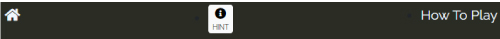
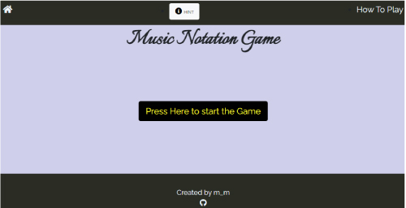

# Music Notation Game

- [Table of Contents](#music-notation-game)
  * [The purpose for this site](#the-purpose-for-this-site)
  * [**User experience(UX)**](#--user-experience-ux---)
    + [**Target Audience**](#--target-audience--)
    + [**Strategy**](#--strategy--)
      - [**User goals**](#--user-goals--)
      - [**Site owner’s goal**](#--site-owner-s-goal--)
    + [**User Stories**](#--user-stories--)
    + [**Scope**](#--scope--)
    + [**Structure**](#--structure--)
    + [**Skeleton**](#--skeleton--)
  * [**Features**](#--features--)
    + [**Game page**](#--game-page--)
    + [**Title and big start button**](#--title-and-big-start-button--)
    + [**The Game Area**](#--the-game-area--)
    + [**The Score Area**](#--the-score-area--)
    + [**HINT popup window**](#--hint-popup-window--)
    + [**How to Play page**](#--how-to-play-page--)
    + [**How the game is played**](#--how-the-game-is-played--)
    + [**Game process**](#--game-process--)
      - [Features Left to Implement](#features-left-to-implement)
  * [Technologies](#technologies)
    + [Languages](#languages)
    + [Other Technologies, Frameworks & Libraries](#other-technologies--frameworks---libraries)
  * [Testing](#testing)
    + [Validating code](#validating-code)
  * [Deployment](#deployment)
  * [**Credits**](#--credits--)
      - [**Coding**](#--coding--)
    + [**Media**](#--media--)

<small><i><a href='http://ecotrust-canada.github.io/markdown-toc/'>Table of contents generated with markdown-toc</a></i></small>

This site is created as a Milestone project for Code Institute's Software Development course.

Here is a link to the live project: [Music Notaion game](https://mwmlln.github.io/ms2_music_notation_game/)

## **The purpose for this site**
---
Music Notation game is a site that hopes to help users learn to read very basic music notations while playing a game and having fun. 

The idea of this game came up when I learned that reading music notations is not included in school’s curriculum in Ireland and numerous of people do not have any idea how to read them.

Ability to read music notations is often a key to playing a musical instrument but learing to read them can be boring and time consuming. This game hopes to make the process enjoyable.

Contents:

## **User experience(UX)**
---

### **Target Audience**

This game is created for anyone who wants to get familiar with music notations whilst having fun playing game. The game has buttons inside the keyboard layout so users can get familiar with music notation names, also positions of the keys.

### **Strategy**
---

#### **User goals**
*	Get familiar with music notation
*	Improve their ability to read music notations quickly 
*	Enjoy playing a game

#### **Site owner’s goal**

The main objective for creating this site was to gain skill set to build a presentable and interactive web site. To achieve this following considerations are taken:

*	Creating a simple game site anyone can enjoy and gain an ability to read basic music notations.
*	Creating a consistent design and easy navigate pages for any user without any confusing elements.
*	Efforts to create code clearly so that further implementation would go smoothly.

### **User Stories**

This site is created following user’s expectations in mind.

* A first time user would like to:
    * Have a clear instruction on what the game objective is and how to achieve it
    * Easy access to instructions on how to play the game
    * Have a clear choice of action presented to engage in the game (i.e. which buttons to press in order to achieve their goal)
    * Have an easy navigation within the site

* A returning user would like to have the following 
   * An  ability to navigate the site easily
   * Consistent page layout they can easily get familiar with
   * Easy access to instructions on how to play the game to refresh their memory
   * Ability to see their improvement as they return to the game

* As a site creator I would like to provide:
  * Interactive and educational site
  * Ability to enjoy challenges so that a user can improve their skill and have fun at the same time.
  * Providing pleasant user experience to leave a positive impression about our site and the topic.

### **Scope**
The scope of Music Notation game defined by the following features:

 * Simple and clear opening page.
 * Functioning game including clear feedback for user’s answer.
 *	Responsive design that displays properly in all device sizes.
 *	Easy to navigate pages with consistent navigation bar.
 *	Quick access to HINT popup window.
 *	How To Play page for instruction on playing the game.

### **Structure**

 * Navigation bar and footer are present on both pages for users to navigate within the site
 * On the opening page Title and large start button present in display
 * Once the start button is pressed gaming panel is displayed and the game becomes accessible.
 * Choose 1 of 7 buttons and press for answer
 * Feedback is given to user’s answers and score will update.
 * Last score section to display the score from previous game.
 * HINT button located in the navigation bar in game page
 * Timer to notify the remaining seconds and RESET button to exit the game early.

### **Skeleton**

Initial design wirefame

 

* **Desktop**

Desktop version of landing page
 

The initial design was to have all components displayed in one page.
This approach turned out to be slightly confusing for users and caused game functions to produce unexpectd behaviours.
To make the gaming page simple, a decision was taken to move the How to Play section into another page rather than the popup window. This approach was taken so that too many components present in one page doesn't cause confusion for users.
HINT button was moved into the nave bar for easier access.

 Implemented Desktop version of How To Play page
 

Initial design of How To play page consisted of game instructions and an image, however the image was taken out as it seemed unnessesary when users have easy access to it in the gaming page.

* **Mobile**

Mobile version of landing page
 

Mobile version has taken the same modification of PC version to UI, reducing popup window and having How To Play in another independent page.

## **Features**
---

The web page consists of two pages, one for playing the game and the other for instruction on how to play the game.
Both pages have almost identical navigation bar and footer, with HINT button added in the navigation bar only in the main gaming(index) page.

Navigation bar
 

Footer
 

### **Game page** 

The game page only displays title and large start button to make it clear what button needs to be pressed to start a game.

Main game page
 

### **Title and big start button**

A big start button is the only thing a user can see in the main page body besides the title. This approach was taken to make it simple and clear what the fist step is to play the game. 

### **The Game Area**

It consists of timer, reset button, image display area and buttons that are located in the layout of a keyboard. 
Once the start button is pressed, a random image of 1 note will be displayed from a total of 7 images.
There are 7 buttons below the image, each have an alphabet for the Notaion name.
A user will try to press the right key(i.e Notaion name alphabet) for the note image displayed. Upon the right answer to increase their score.

Main game panel
 

### **The Score Area**

Each time a user gets a correct answer, the score will increment by 1. The score area displays the score for the current game on the left side.
On the right side, the score from the last game is displayed to remind the user so that they can try to improve their skill in each game.

Score Area
 

### **HINT popup window**

The button to display a popup window is located in the navigation bar in the gaming page.
This window contains an image with all the notaion and alphabets used for the game. 
The bootstrap modal is used to diplay this window.

Hint popup window
 

  

### **How to Play page**
This page is created to provide instructions on how to play the game.
A user can read this page to understand how the game works prior to starting.

How To Play Page
 
 

### **How the game is played**

On opening, the web site users are presented with a nav bar, a footer and main body with a title and large play button which will initiate a game. 

This is the steps a user will take to play the game.

### **Game process**

*  After the page is loaded, a user has three main choices which are:

    1  Visit How To Play page by clicking the menu in the navigation bar.
    

How To Play Page
 

    2  Display popup window with all music notation used in the game and corresponding alphabet names by pressing HINT button located in the centre of the navigation bar. This HINT window can be accessed during the game if a user wants to see the image.

    

Hint popup window
 

    3   Press the large play button to start the game. By pressing this button, the start button disappears and the gaming panel will display, allowing user to engage with the game.
    Following describe general game process once the start button is pressed.
    
      * Countdown timer will start counting down from 60 seconds.

          

Countdown Timer
 

      * An image with one notation is displayed.            

        

Notation image diplay
 
  

      * A user need to find a right alphabet for the notation image and press the corresponding key button under the image panel.  
    
        

Keyboard buttons
 

     
      * If the answer is correct, the key button becomes green for one second to notify the user. If the answer given is wrong, key button will turn red instead.
       

      * Score will also go up by 1 when the answer is correct.    
    

      * Another image will be displayed. A user will repeat the previous process and try to get as many correct answers to obtain high score during 60 seconds.
      Scores for current game and previous game are displayed just under the corret/Wrong Area.
        

score
 
   
       
      * When the countdown timer turns zero, the popup window is displayed to notify the user about the game completion with the final score.
        

Game Over popup window
 
         

      * The final score is recorded in the Last Score section so that a user can refer to their previous score in the next game and try to improve their skill.

      * Once the user press OK button in the Game Over popup window, the timer and score are reset back to the default value. Gaming panel disappears and a large start button is present again, ready for another game.

      * A user can press reset button located beside timer, during the game to cancel the game and return to start page.

#### Features Left to Implement

The initial intention for the game was to have corresponding sounds when the randomly selected notation image was displayed and also when a user pressed the alphabet buttons. However the nature of the game being fast paced, playing audio consistently and each sound to be clearly identifiable turned out to be too difficult to implemet at this stage due to short space of time given to complete the project.

## **Technologies**
--- 

### **Languages**

 * HTML5
 * CSS3
 * JavaScript

### **Other Technologies, Frameworks & Libraries**

 * Google Fonts
 * Bootstrap v5.0
 * Font Awsome
 * GitHub and Gitpod
 * Balsamic
 
## **Testing**
--- 

This site was tested with number of ways to ensure the game function works as intended and has a clear procedure that is easy to understand for every user.

Throughout the development phase, code was tested line by line where possible, using chrome developper tool. This is to ensure that the returned value from each function matches to the value expected. This approach was taken so that any small errors in one function does not cause bigger problems in the whole project. This approach also brought me some small comfort when function behaved as expected during the rathter overwhelming project for a novice coder.

Below are some challenges during the development and tesing phase.

* Initial design on wireframe was to have all the components displayed at all the time. This layout presented two major issues preventing game functions to work properly
  1. Pressing start buttons number of times triggered countdown timer to diplay multipule count down processes causing number displayed in the timer inconsistent.
 
  2. Pressing alphabet key button for answer before start button is pressed can increase score without timer and other functions starting.

  These errors were rectified by hiding game panel until the game is started and the start button replaced by small reset button once the game is started. This approach was suggested by my mentor and it solved the issues above and improved the site's appearance and clarity.

* When the reset button was implemented to give user an optoin to exit the game early, the timer error ocurred same way the start button was pressed more than once. (i.e. user start a game then exit early by pressing button. Restarting game within 60 seconds, the timer displayed two countdown process resulting the numbers displayed going up and down.)
This error was fixed by giving the timer a status of true or false and for it to refer this status in order to continue the process. 

* Each pages has been tested for responsiveness, making sure that the layout structure is kept intact on all devce sizes.
CSS min-height and min-width was used for layout where view height and view width was set to ensure that the image or layout doesn't overflow.
The footer is set to stay on the bottom of the page for consistent appearance.

### **Validating code**

No errors were returned when passing through the official [W3C validator](https://validator.w3.org/nu/?doc=https%3A%2F%2Fmwmlln.github.io%2Fms2_music_notation_game%2F)

Result screenshot
 
 

No errors were found when passing through the official (Jigsaw) validator [(Jigsaw) validator](https://jigsaw.w3.org/css-validator/validator?uri=https%3A%2F%2Fmwmlln.github.io%2Fms2_music_notation_game%2Fassets%2FCSS%2Fstyle.css&profile=css3svg&usermedium=all&warning=1&vextwarning=&lang=en)

Result screenshot
 

No major issues or errors were returned by [JSHint](https://jshint.com/)
  The following metrics were returned:
   *  There are 21 functions in this file.
   *  Function with the largest signature take 0 arguments, while the median is 0.
   *  Largest function has 8 statements in it, while the median is 2.
   *  The most complex function has a cyclomatic complexity value of 4 while the median is 1.

## **Deployment**
--- 
This site was published in GitHub.
Following in the procedure taken to deploy this page.
1. Log in to GitHub
2. Open the repository that is created for this website.
3. Open setting page within the repository.
4. Navigate to the page tab
5. Change the branch from None to Master.
6. Website link is provided, copy the link and paste it onto link section in my repository page. This is the link to the published site,  [Music Notaion Game](https://mwmlln.github.io/ms2_music_notation_game/)

## **Credits**
--- 

#### **Coding**

Main approach for creating this game was taken from Code Institute's walk through project video of Love Maths.
Among with other tutorial videos and online books outside the course material to gain general knowlge of JavaScript I have used [Mozilla](https://developer.mozilla.org/) and [Stackoverflow](https://stackoverflow.com) and google search for solutions to make this game work. In particular, below are the links that I used as a help for some of the functions to work.

* This YouTube tutorial has helped me to create the countdown timer.
https://www.youtube.com/watch?v=AHh57PrdQsA  
* For using clearing inteinterval for the countdown Timer.
https://stackoverflow.com/  
 * For blinking start button
https://www.educba.com/css-blinking-text/   

* For setTimeout to remove button color after 1 second  https://www.sitepoint.com/delay-sleep-pause-wait/

* Displaying ramdom image
  https://www.javatpoint.com/random-image-generator-in-javascript

* CSS in easy steps (book) by Mike Macgrath   For general CSS coding reference

### **Media**

* Color theme was chosen from this site https://coolors.co/cfcfea-a89b9d-816c61-575a4b-2a2c24

* Music clef and notaion image  https://illustimage.com/

* Screenshots and the imgae in HINT page was created by Adobe Illustrator

**Fonts**

 * https://fonts.google.com/

**Icons**

 * https://fontawesome.com/

