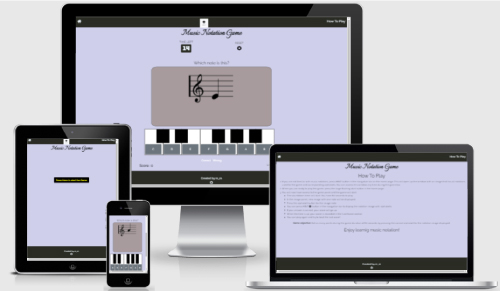
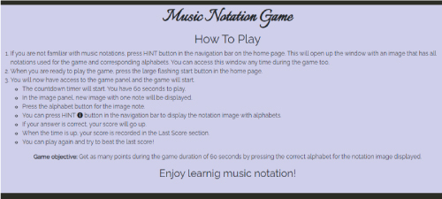
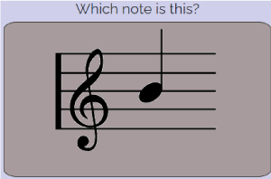

# Music Notation Game

This site is created as a Milestone project for Code Institute's Software Development course.

## The purpose for this site
Music Notation game is a site that hopes to help users learn to read very basic music notations while playing a game and having fun. 

Ability to read music notations is a key to play musical instrument but learing to read them can be boring and time consuming. This game hopes to make the process enjoyable.

## UX

### **Target Audience**

This game is created for anyone who wants to get familiar with music notations while they have fun playing game. The game has buttons inside the keyboard layout so users can get familiar with music notation names also positions of the keys.

## Features

The web page consists of two pages, one for playing the game and other for instruction on how to play the game.
Both pages have almost identical navigation bar and footer, with HINT button added in the navigation bar only in the main gaming(index) page.

 

 

### Game page 

The game page only displays title and large start button to make it clear what button needs to be pressed to start a game.

### Title and big start button.

This big start button is the only thing a user can see in the main page body besides title. This approach was taken so that the first action required to be taken is clear to the users. 

### The Game Area

It consists of image display area and buttons that are located in the layout of a keyboard. 
Once the start button is random image of 1 note will be displayed from total of 7 images.
7 buttons each have an alphabet for the image are located on the keyboard layout.
A user will try to press the right key for the image displayed and increase their score.

 

### **The score Area**

The score area displays the score for the current game, also the score from the last game so that a user can try to improve their skill in each game.

  

### **HINT** popup window

The button to display a popup window is located in the navigation bar in the gaming page.
This window contains a image with all notaions and alphabets used for the game. 

  

### **How to Play page**
This page is created to provide instructions on how to play the game.
A user can read this page to understand how the game works prior to starting their game.

  

### **How the game is played**

On opening the web site users are presented with a nav bar, a footer and main body with a title and large play button which will initiate a game. This approach was taken to avoid too many component presented at the first sight so that it will be clear what action need to be taken as a very first step to play the game.

This is the steps a user will take to play the game.

*  After the page is loaded, a user has three main choices which are:

    1  Visit How To Play page by clicking the menu in the navigation bar.
    

    2  Display popup window with all music notations used in the game and corresponding alphabet names by pressing HINT button located in the centre of the navigation bar. This HINT window can be accessed during the game if a user wants to see the image.

    

    3   Press large play button to start the game. By pressing this button, the start button disappears and the gaming panel will display, allowing user to engage with the game.
    Following describe general game process once the start button is pressed.
    
      * Countdown timer will start counting down from 60 seconds.

      

      * An image with one notation is displayed. 

      

      * A user need to find a right alphabet for the notation image and press the corresponding key button under the image panel.
     
      * If the answer is correct, "Correct" word becomes green to notify the user. If the answer given is wrong, word "Wrong" will turn red for one second instead.

       

      * Another image will be displayed. A user will repeat the previous process and try to get as many correct answers to obtain points during 60 seconds.
      Scores for current game and previous game are displayed just under the corret/Wrong Area.

       

      * When the countdown timer turns zero, popup window is displayed to notify the user about the game completion with the final score.

      

      * The final score is recorded in the Last Score section so that a user can refer their previous score in the next game and try to get better score.

      * Once the user press OK button in the popup window, the timer and score are reset back to default value. Gaming panel disappears and large start button is present again, ready for another game.

      * A user can press reset button located beside timer during the game to cancel the game and return to start page.

#### Features Left to Implement

Initial intention for the game was to have corresponding sound when the randomly selected image was displayed and also when a user pressed the alphabet button. However nature of the game being speedy, the solution to play audio consistently could not be implemented at this time.

## Testing

This site was tested with number of ways to ensure the game function works and has clear procedure that is easy to understand for every user.

Initial design on wireframe was to have all the components displayed at all the time. This layout presented two major issues preventing game functions to work properly
 1. Pressing start buttons number of times triggered countdown timer to diplay multipule count down processes causing number displayed in the timer inconsistent.
 
 2. Pressing alphabet key button before starting a gamecan gain points losing a point of having timer.

These errors were rectified by hiding game panel until the game is started and hide the start button and replaced by small reset button once the game is started.

When the reset button was implemented to give user an optoin to exit the game, the timer error ocurred same way start button was pressed more than once. This error was fixed by giving a timer status that was set on and off at appropriate stage in the process.

### Validating code

No errors were returned when passing through the official [W3C validator](https://validator.w3.org/nu/?doc=https%3A%2F%2Fmwmlln.github.io%2Fms2_music_notation_game%2F)

No errors were found when passing through the official (Jigsaw) validator [(Jigsaw) validator](https://jigsaw.w3.org/css-validator/validator?uri=https%3A%2F%2Fmwmlln.github.io%2Fms2_music_notation_game%2Fassets%2FCSS%2Fstyle.css&profile=css3svg&usermedium=all&warning=1&vextwarning=&lang=en)

No major issues were returned by https://jshint.com/
  The following metrics were returned:
   *  There are 21 functions in this file.
   *  Function with the largest signature take 0 arguments, while the median is 0.
   *  Largest function has 8 statements in it, while the median is 2.
   *  The most complex function has a cyclomatic complexity value of 4 while the median is 1.

## Deployment
This site was published in GitHub.
Following in the procedure taken to deploy this page.
1. Log in to GitHub
2. Open the repository that is created for this website.
3. Open setting page within the repository.
4. Navigate to the page tab
5. Change the branch from None to Master.
6. Website link is provided, copy the link and paste it onto link section in my repository page. This is the link to the published site[https://mwmlln.github.io/ms2_music_notation_game/]

## Credits

#### Coding

Main approach for creating this game was taken from Code Institute's walk through project video of Love Maths.
Among with other tutorial video and online books outside the course material to gain general knowlge of JavaScript I have used https://developer.mozilla.org/ and https://stackoverflow.com and google search for solutions to make this game work. In particular, below are the links that I used as a help for some of the functions to work.

https://www.youtube.com/watch?v=AHh57PrdQsA  This YouTube tutorial has helped me to create the countdown timer.
https://stackoverflow.com/  For using clearing inteinterval for the countdown Timer.

#### **Displaying ramdom image**
   https://www.javatpoint.com/random-image-generator-in-javascript

### Content

### Media

Color theme was chosen from this site https://coolors.co/cfcfea-a89b9d-816c61-575a4b-2a2c24

Music clef and notaion image  https://illustimage.com/

**Fonts**

https://fonts.google.com/

**Icons**

https://fontawesome.com/